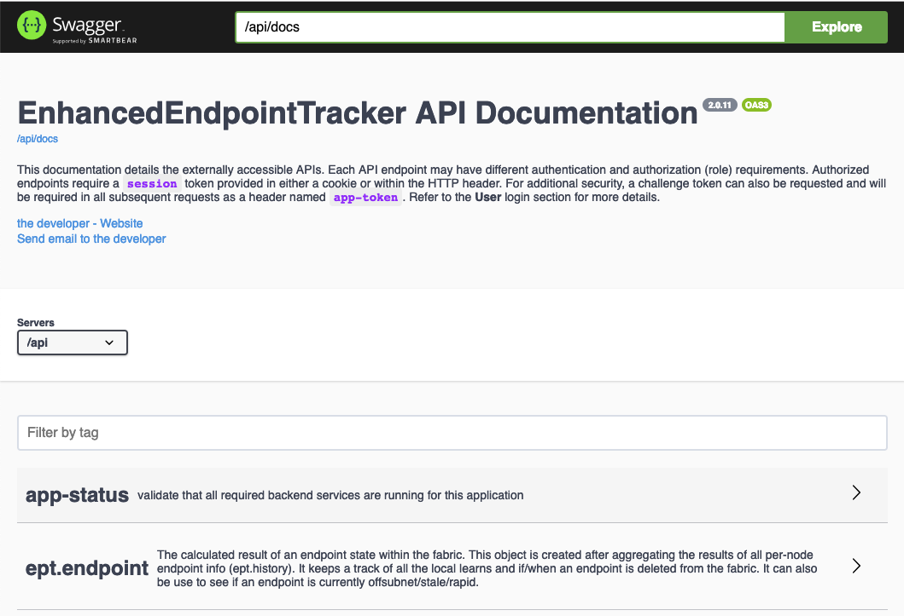
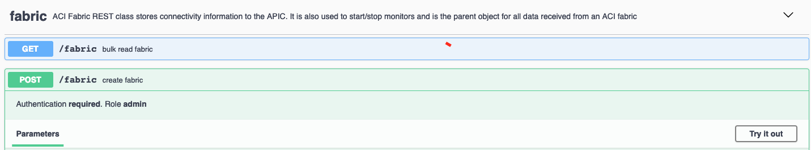

API
===

The EnhancedEndpointTracker app has a fully documented 
`swagger-ui <https://swagger.io/tools/swagger-ui/>`_ conforming to the open api 3.0 standard. You 
can access the swagger docs running on the app at 
`https://APP_IP/docs <https://localhost:5000/docs>`_. 

|swagger-ui-p1|

.. note:: The swagger-ui page is only available when running in ``standalone`` mode.

The API provides paging, advanced filtering and sorting, and attribute projections. The full syntax
is documented within the swagger docs. The docs also include authentication and authorization
requirements per REST endpoint. For example, to create a fabric the user must be authenticated and
have an ``admin`` role.

|swagger-ui-p2|

Getting Started with API
------------------------

To begin you need to login and get a session identifier. Subsequent API requests must provide the 
session id in a cookie named ``session`` or an HTTP header named ``session``.  To login, provide a 
username and password to the user login API.  Note, this is also documented within the swagger-ui 
docs under the ``user`` object. The example below uses curl and assumes that an instance for the app
is running with HTTPS service on localhost:5000.  

.. code-block:: bash

   host$ curl -skX POST "https://localhost:5001/api/user/login" \
         --cookie-jar cookie.txt --cookie cookie.txt \
         -H "Content-Type: application/json" \
         -d "{\"password\":\"cisco\", \"username\":\"admin\"}"
   result:  
        {"session":"tBoERKg8qXbldyRZ/tkn4/9I8PUapQHDYbMepzSw1b6ZEW1NKur0JyscDv9b80Nf/pZB8U4Q6megY8B++a32OQ==","success":true,"token":""}

On successful login the web-server will reply with both the session id and an HTTP Set-Cookie header
with the same value. This allows users to POST to the login url and receive the session cookie in
JSON reply and within a cookie.  Subsequent requests only need to reference the cookie for
authentication.

For example, to get the list of configured fabrics referencing the existing cookie:

.. code-block:: bash

   host$ curl -skX GET "https://localhost:5000/api/fabric?include=fabric,apic_hostname" \
         --cookie-jar cookie.txt --cookie cookie.txt \
         -H "Content-Type: application/json" 
   result:
   {"count":1,"objects":[{"fabric":{"apic_hostname":"esc-aci-network.cisco.com:8062","dn":"/uni/fb-fab4","fabric":"fab4"}}]}

API Access on the APIC
----------------------

The APIC restricts stateful applications to use **GET** and **POST** methods only along with
enforcing static URL endpoints.  Since this app uses RESTful **GET**, **POST**, **PATCH**, and 
**DELETE** operations along with dynamic endpoints, a ``proxy`` mechanism was implemented to tunnel
all requests through **POST** to a single URL on the APIC.  This allows for seemless migration of
the source code for both frontend and backend components when running on the APIC or running in
standalone mode. For the proxy operation, the following three fields are required in each POST:

* **method** is the original HTTP method intended for the app (**GET**, **POST**, **PATCH**, or
  **DELETE**)
* **url** is the original url such as ``/api/fabric``
* **data** is any required data sent in a **POST** or **PATCH** request that needs to be proxied to
  the backend services.

The user must also have admin read access on the APIC and use the APIC aaaLogin api to acquire a 
token for accessing the app API. The token must be included in all requests an HTTP header named 
``DevCookie``.

* If running in ``mini`` mode, use the following url for all request:

    https://APIC_IP/appcenter/Cisco/EnhancedEndpointTrackerMini/proxy.json

* If running in ``full`` mode, use the following url for all requests:
    http://APIC_IP/appcenter/Cisco/EnhancedEndpointTracker/proxy.json

An example using curl on the APIC CLI:

.. code-block:: bash

   # login to the APIC with appropriate admin credentials
   apic:~> export token=`curl -skX POST "https://127.0.0.1/api/aaaLogin.json" \
    -H "Content-Type: application/json" \
    -d '{"aaaUser":{"attributes":{"name":"username", "pwd":"password"}}}' \
        | python -m json.tool | grep token | cut -d'"' -f4`

   # verify that a token was acquired
   apic:~> echo $token
   akoAAAAAAAAAAAAAAAAAAOWxfZ8iEOFKQRpFiNNT1w2qXUFV8Gt2PyJ43FG8lGi2gu//zEOU8lpWx1LNS1BG49mY6XjaXeI9m9RtgWhzEGlWWIJ7RgFBW3SOnUlbHs0kj8Xcsj0ZOxanBdWwA3c5TWDys7wpGbxVlz926MrR4KR3NOGCILjde86KnhbPqedgfNqVA2/cF5heh8sck7oTK4pcnu2pn7f4WDULXJ4gEA5rMWiYgtrSTiG+oeclkt4v

   # read the auto-discovered fabric objects
   curl --header "DevCookie: $token" \
        --header "Content-Type: application/json" \
        -skX POST "https://127.0.0.1/appcenter/Cisco/EnhancedEndpointTrackerMini/proxy.json" \
        -d '{
          "method": "GET",
          "url":"/api/fabric?include=fabric,apic_hostname",
          "data": {}
        }'
   result:
   {"count":1,"objects":[{"fabric":{"apic_hostname":"https://172.17.0.1","dn":"/uni/fb-esc-aci-fab4","fabric":"esc-aci-fab4"}}]}

