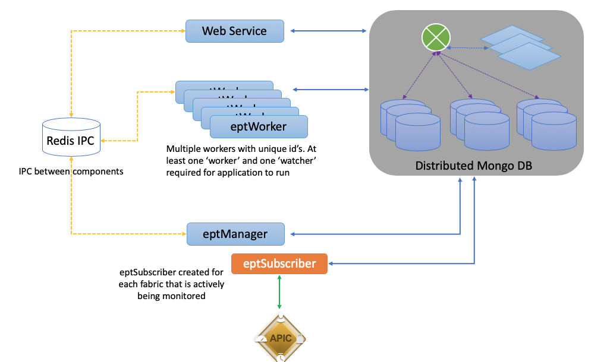

Components
==========

The EnhancedEndpointTracker app is composed of several components that can be deployed as either 
multiple processes running within the same container in ``mini`` or ``all-in-one`` mode or as 
separate containers distributed over multiple nodes in ``full`` or ``cluster`` modes.  

|backend-components-p1|

mongoDB 
-------

  `mongoDB <https://www.mongodb.com/>`_ ``3.6`` is used for persistent storage of data.  In 
  ``mini`` mode this is a single mongo process with journaling disabled and wireTiger cache size 
  limit to 1.5G memory.  In ``cluster`` mode, it runs as a distributed database utilizing mongos, 
  configsvr in replica set, and multiple shards configured in replica sets. Sharding is enabled for 
  a subset of collections, generally based on endpoint address.

redisDB
-------

  `redisDB <https://redis.io/>`_ is in an memory key-store database. It is used as a fast IPC 
  between components. There are two main messaging implementations in this app. 

  * `Publish <https://redis.io/commands/publish>`_/
    `Subscribe <https://redis.io/commands/subscribe>`_ mechanism allows for a component to publish 
    a message on a channel that is received by one more subscribers

  * Message queue via `rpush <https://redis.io/commands/rpush>`_ and 
    `blpop <https://redis.io/commands/blpop>`_ with support for queue prioritization.

WebService
-----------

  Python `Flask <http://flask.pocoo.org/>`_ and `Apache <https://httpd.apache.org/>`_ are used for 
  the web service.  

eptManager
----------

  ``eptManager`` is a python process that is responsible for starting, stopping, and monitoring 
  ``eptSubscriber`` proceses along with tracking the status of all available ``eptWorker`` 
  processes. It is also responsible queuing and distributing all work that is dispatched to worker 
  processes. There is only a single instance of ``eptManager`` deployed within the app.

eptSubscriber
-------------

  ``eptSubscriber`` is a python process responsible for communication with the APIC. It collects 
  the initial state from the APIC and stores into the db. It establishes and monitors a websocket 
  to the APIC with subscriptions for all necessary MOs and ensures the db is in sync with the APIC. 
  ``eptSubscriber`` process also subscribes to all epm events and dispatches each event to 
  ``eptManager`` which will enqueue to an appropriate ``eptWorker`` process to analyze the event.  
  There is a single ``eptSubscriber`` process running for each configured fabric.  This process is 
  always a subprocess running in the same container as ``eptManager``.

  The following objects are collected and monitored by the subscriber process:

  * datetimeFormat
  * epmIpEp
  * epmMacEp
  * epmRsMacEpToIpEpAtt
  * fabricAutoGEp
  * fabricExplicitGEp
  * fabricNode
  * fabricProtPol
  * fvAEPg
  * fvBD
  * fvCtx
  * fvIpAttr
  * fvRsBd
  * fvSubnet
  * fvSvcBD
  * l3extExtEncapAllocator
  * l3extInstP
  * l3extOut
  * l3extRsEctx
  * mgmtInB
  * mgmtRsMgmtBD
  * pcAggrIf
  * pcRsMbrIfs
  * tunnelIf
  * vnsEPpInfo
  * vnsLIfCtx
  * vnsRsEPpInfoToBD
  * vnsRsLIfCtxToBD
  * vpcRsVpcConf

eptWorker
---------

  There is a configurable number of ``eptWorker`` processes that can be executed. Each ``eptWorker`` 
  must have a unique id and will be deployed with a role of either a **worker** or **watcher** 
  process. ``eptManager`` requires at least one active ``eptWorker`` for all roles before it can 
  start any fabric monitors.  The ``eptWorker`` **worker** process performs the bulk of the 
  computations for the app.  It receives epm events and performs move/offsubnet/stale/rapid analysis 
  and stores the results into the db.  If an endpoint is flagged by one of the analyses, a message 
  is sent to ``eptManager`` to enqueue to an ``eptWorker`` **watcher** process.  The **watcher** 
  will perform the configure notifications along with executing rechecks to prevent incorrect 
  detection of transitory events.

The full source code for the Flask web-service implementation and all ept components is available on 
`Github <https://github.com/agccie/ACI-EnhancedEndpointTracker>`_.

