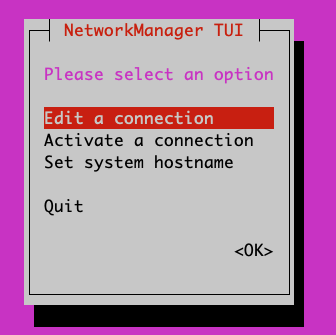
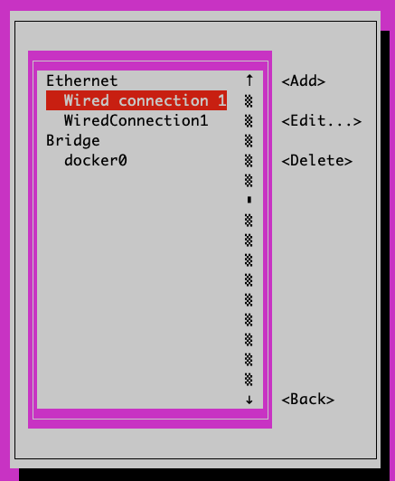
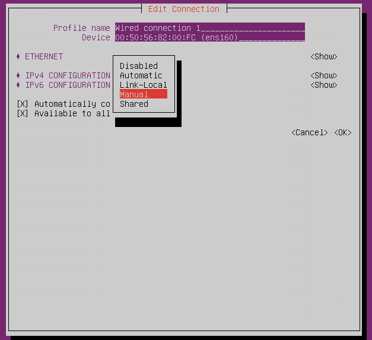
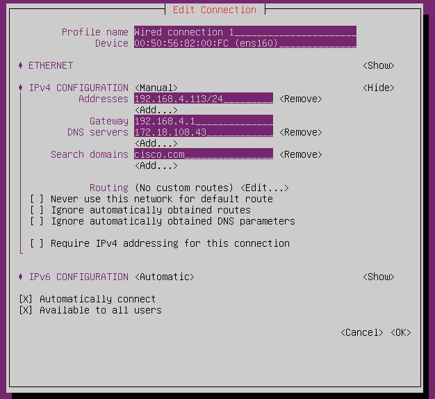
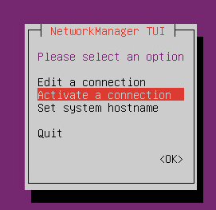
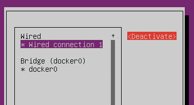
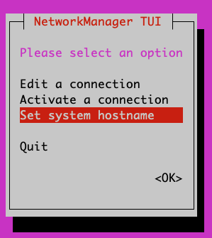
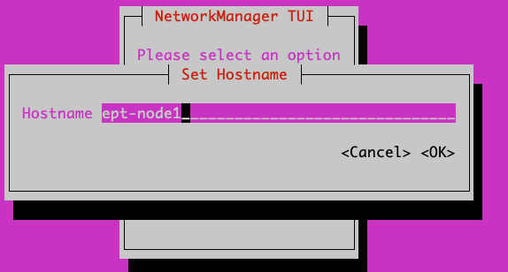

.. _install:

Install
=======

The ACI EnhancedEndpointTracker can be installed directly on the APIC as an ACI app or deployed as
a standalone application hosted on a baremetal or virtual machine.

ACI Application
---------------

The application can be deployed on the APIC. There are two modes supported, both available on 
`ACI Appcenter <https://aciappcenter.cisco.com>`_.

* `mini <https://aciappcenter.cisco.com/enhancedendpointtracker-mini-2-2-1n-2-1-230.html>`_ is backwards 
  compatible with APIC 2.x and 3.x. However, there are memory constraints that limit the supported 
  scale

* `full <https://aciappcenter.cisco.com/enhancedendpointtracker-4-0-1g-2-1-228.html>`_ scale application 
  supported on APIC 4.x and above.

After downloading the app, follow the directions for uploading and installing the app on the APIC:

* `2.x Install Video Example <https://www.cisco.com/c/en/us/td/docs/switches/datacenter/aci/apic/sw/2-x/App_Center/video/cisco_aci_app_center_overview.html>`_
* `2.x Install Instructions <https://www.cisco.com/c/en/us/td/docs/switches/datacenter/aci/apic/sw/2-x/App_Center/developer_guide/b_Cisco_ACI_App_Center_Developer_Guide/b_Cisco_ACI_App_Center_Developer_Guide_chapter_0110.html#d7964e613a1635>`_
* `3.x Install Instructions <https://www.cisco.com/c/en/us/td/docs/switches/datacenter/aci/apic/sw/2-x/App_Center/developer_guide/b_Cisco_ACI_App_Center_Developer_Guide/b_Cisco_ACI_App_Center_Developer_Guide_chapter_0110.html#d11320e725a1635>`_ 

.. note:: Ensure you select security domain **all** when installing on the APIC

In you are executing the ``mini`` app, the APIC will enforce a **2G** memory limit and a **10G** 
disk quota.  As a result, it may crash if there are a large number of endpoints or high number 
events per second. As a best practice, it is recommended to deploy in ``full`` mode or 
``standalone`` mode if the total number of per-node endpoints exceeds ``32k``.  You can determine 
the per-node endpoint count via the following moquery on the APIC:

.. code-block:: bash

    apic# moquery -c epmDb -x query-target=subtree -x target-subtree-class=epmIpEp,epmMacEp,epmRsMacEpToIpEpAtt -x rsp-subtree-include=count

If running ``mini`` mode and it is exceeding the memory limits, you may see the symptoms below:

* Consistent monitor restarts due to "subscriber no longer running"
* Monitor restart due to "worker 'w0' not longer active"
* Monitor stuck or restarting during "getting initial endpoint state"

Standalone Application
----------------------
The ``standalone`` app is one that runs on a dedicated host/VM and makes remote connections to the 
APIC opposed to running as a container on the APIC.  For large scale fabrics or development 
purposes, standalone is the recommended mode to run this application.  The standalone app also has 
a few different deployment options:

* ``all-in-one`` is a single container with all required processes running.  This is similar to 
  ``mini`` mode executing on the APIC, however the memory and compute restrictions are based on the 
  host device and therefore can support much larger scale. This is the easiest way to deploy the 
  app as it can be started with a single command.

* ``cluster`` uses a distributed architecture to execute multiple container across one or more 
  nodes. This allows the app to scale with the size of the fabric. This is similar to the ``full`` 
  mode executing on the APIC but can be deployed in any custom environment that supports container 
  orchestration. 

  If you are deploying the cluster with more than one node, ensure there is connectivity between
  each node in the cluster and the following ports are allowed:

  * **TCP** port **2377** for cluster management
  * **TCP** and **UDP** port **7046** for communication between nodes
  * **UDP** port **4789** for overlay traffic
  * **TCP** port **22** for auto-deployment and setup

All-in-One Mode
^^^^^^^^^^^^^^^

To execute in ``all-in-one`` mode, you need a host with docker installed.  See the 
`Docker documentation <https://docs.docker.com/install/>`_ for installing docker on your host.  
Once installed, execute the following command to download the EnhancedEndpointTracker docker image 
and run it:

.. code-block:: bash

    host$ docker run --name ept -p 5000:443 -d agccie/enhancedendpointtracker:latest

The command will start an instance of EnhancedEndpointTracker with the web server running on port 
5000. Login to the web UI at `https://localhost:5000 <https://localhost:5000>`_.  See the usage 
section for further details regarding how to use the app.

Cluster Mode - OVA
^^^^^^^^^^^^^^^^^^

The EnhancedEndpointTracker app can be deployed in a distributed cluster. Users can deploy in their 
own cluster or use a prebuilt OVA. This section will focus on the OVA.

.. note:: Please send an email to aciappcenter-support@external.cisco.com to request a temporary
          download link for the EnhancedEndpointTracker OVA.

The recommended sizing for the VM is as follows:
   * 8 vCPU
   * 16G memory
   * 75G harddisk, thick provisioned

The OVA contains the following components preinstalled:
   * Ubuntu 18.04.2 LTS
   * OpenSSH
   * Docker CE 18.09.02
   * Python 2.7.15rc1
   * Network manager 
   * EnhancedEndpointTracker docker image specific to the version of the OVA 
   * A copy of the EnhancedEndpointTracker 
     `source code <https://github.com/agccie/ACI-EnhancedEndpointTracker>`_ located in 
     */opt/cisco/src* directory

To get started with the OVA, perform the following steps:

  * `Configure Host Networking`_
  * `Configure NTP and Timezone`_
  * `Configure the Cluster and Deploy the Stack`_

Configure Host Networking
~~~~~~~~~~~~~~~~~~~~~~~~~

Once the OVA is deployed, access the console with the credentials below. Note, you will be required 
to change the password on first login.

* username: **eptracker**
* password: **cisco**

The OVA is simply a Ubuntu 18.04 install. Users can use any mechanism they prefer to initialize the 
network.  The example below uses network manager TUI which is preinstalled on the host.

* Enter **sudo nmtui**
* Choose 'Edit a connection' 

|standalone-console-nmtui-p1|

* Edit the appropriate connection. By default, the connection type is likely **Automatic** (DHCP) 
  but if you need to set a static IP address you will need to change the mode to **Manual** and the 
  set the appropriate info.

|standalone-console-nmtui-p3|

|standalone-console-nmtui-p4|

* To apply the updated configuration, you will need to deactivate and then activate the configured 
  interface.

|standalone-console-nmtui-p5|

|standalone-console-nmtui-p6|

* Ensure you also set the hostname for the host.  You will need to logout and log back in to see the 
  hostname updated.

|standalone-console-nmtui-p8|

|standalone-console-nmtui-p9|

Configure NTP and Timezone
~~~~~~~~~~~~~~~~~~~~~~~~~~

All timestamps for the app are based on the timestamp of the server itself.  If you are running the 
app on a cluster with more than 1 node or if the time on the host is unreliable, then timestamps for 
events and analysis may be incorrect.  Use **timedatectl** to configure your timezone and the ntp 
servers.

* List the available options and set to the desired timezone.

  .. code-block:: bash
    
        eptracker@ept-node1:~$ timedatectl list-timezones | grep New
        America/New_York
        America/North_Dakota/New_SalemA

        eptracker@ept-node1:~$ sudo timedatectl set-timezone America/New_York

* Use vim or your favorite editor to set the required NTP servers under */etc/systemd/timesyncd.conf*

  .. code-block:: bash

      eptracker@ept-node1$ sudo vim /etc/systemd/timesyncd.conf

* Uncomment the NTP line and add the appropriate list of NTP servers. For example:

  .. code-block:: bash

      eptracker@ept-node1$ cat /etc/systemd/timesyncd.conf | egrep -A 1 Time
      [Time]
      NTP=172.16.1.1

* Restart the ntp process and validate the configuration was successful. **Note**, it may take 
  several a few minutes before ntp synchronizes the clock:

  .. code-block:: bash

      eptracker@ept-node1:~$ sudo timedatectl set-ntp true
      eptracker@ept-node1:~$ sudo systemctl restart systemd-timesyncd

        eptracker@ept-node1:~$ timedatectl status
                              Local time: Wed 2019-03-13 12:26:50 EDT
                          Universal time: Wed 2019-03-13 16:26:50 UTC
                                RTC time: Wed 2019-03-13 16:26:51
                               Time zone: America/New_York (EDT, -0400)
               System clock synchronized: yes
        systemd-timesyncd.service active: yes  <--------- synchronized
                         RTC in local TZ: no

.. _swarm_config:

Configure the Cluster and Deploy the Stack
~~~~~~~~~~~~~~~~~~~~~~~~~~~~~~~~~~~~~~~~~~

``cluster`` mode with the OVA uses docker swarm for the overlay and network orchestration. Even if 
there is only a single node, the swarm needs to be configured.  Before starting, ensure that 
networking has been configured on all nodes and they are able to communicate on the ports previously 
listed. 

All containers deployed in the stack rely on the ``agccie/enhancedendpointtracker:<version>`` 
container. This is available on docker hub and is also available pre-installed on the OVA. **There 
is  no internet requirement to get the app deployed on the OVA.**

- Step 1: Use the ``app-deploy`` script to initialize the cluster and deploy the app

    The ``app-deploy`` script performs the following operations

    * Configure the host as a swarm leader
    * Export the manager token to all other nodes and add them to the swarm
    * Add a label called ‘node’ with the appropriate node number to each node in the cluster. The 
      docker compose file uses the node labels to ensure the db shards and replicas are properly 
      distributed.
    * Create the docker compose file based on the desired number of shards, replicas, and workers 
      distributed across the cluster nodes.
    * Deploy the stack.

    The default swarm configuration is in the ``/opt/cisco/src/cluster/swarm/swarm_config.yml`` file. 
    You can edit this file before deploying the stack to adjust worker count, db scale, adjust which 
    port the web service is deployed, and enable/disable http. Additionally, you can pass in 
    arguments for worker count and db configuration which will override the swarm_config.

    Use ``--help`` option to see all available arguments to the script.

    .. code-block:: bash

        # example deployment with large scale (default worker/shard/memory is sufficent for most setups)
        eptracker@ept-node1:~$ app-deploy --deploy --worker 64 --db_shard 16 --db_replica 3 --db_memory 3.0
        Number of nodes in cluster [1]: 3

        UTC 2019-04-27 13:19:39.251||INFO||loading config file: /opt/cisco/src/cluster/swarm/swarm_config.yml
        UTC 2019-04-27 13:19:40.018||INFO||compose file complete: /tmp/compose.yml
        UTC 2019-04-27 13:19:41.038||INFO||initializing swarm master

        Enter hostname/ip address for node 2: 192.168.4.112     <--- you will be prompted for node IP
        Enter hostname/ip address for node 3: 192.168.4.113

        Enter ssh username [eptracker]:                         <--- you will be prompted for credentials
        Enter ssh password:

        UTC 2019-04-27 13:19:59.752||INFO||Adding worker to cluster (id:2, hostname:192.168.4.117)
        UTC 2019-04-27 13:20:02.670||INFO||Adding worker to cluster (id:3, hostname:192.168.4.118)
        UTC 2019-04-27 13:20:04.540||INFO||docker cluster initialized with 3 node(s)
        UTC 2019-04-27 13:20:04.541||INFO||deploying app services, please wait...
        UTC 2019-04-27 13:30:07.130||INFO||2 services pending, re-check in 60.0 seconds
        UTC 2019-04-27 13:31:07.483||INFO||app services deployed
        UTC 2019-04-27 13:31:22.499||INFO||deployment complete

.. note:: The ``app-deploy`` script requires that all nodes in the cluster have the same 
        username/password configured.  Once the deployment is complete, you can set unique 
        credentials on each node.

.. tip:: The ``app-deploy`` script is simply an alias to ``/opt/cisco/src/cluster/deploy.py``
        script with some auto-detection for which version to deploy based on the version of the OVA.

- Step 2: Manager the App via the web-GUI

    After deployment is complete, open a web browser to the IP address of any node in the cluster. 
    Using the example above we could access the app on node-3 via to https://192.168.4.113/. The app 
    can be fully managed from the UI. See the usage section for further details regarding how to use 
    the app.

Cluster Mode Manual
^^^^^^^^^^^^^^^^^^^

Users may prefer to manually configure the cluster in any environment that supports container 
orchestration. Deploying each container requires the container image which can be pulled from 
`docker hub <https://hub.docker.com/r/agccie/enhancedendpointtracker>`_ or manually built using the 
`Dockerfile <https://github.com/agccie/ACI-EnhancedEndpointTracker/tree/master/build>`_ on github.
Once built, the entry point for the container must be ``/home/app/src/Service/start.sh`` and 
appropriate arguments and environmental variables are required.  

Manually Deploying Cluster Mode with Docker Swarm
~~~~~~~~~~~~~~~~~~~~~~~~~~~~~~~~~~~~~~~~~~~~~~~~~

This section provides an example for manually deploying cluster mode with docker swarm. This example 
uses **ubuntu 18.04** with **docker 18.09.2**.  It could be extended to support other docker
orchestration environments such as Kubernetes or Nomad. Refer to `Container Arguments`_ and 
`Environmental Variables`_ for more info on required settings for manually deploying a container.

.. note:: These steps assume a linux host or VM. Using docker swarm to deploy a stack on MACOS or
          Windows has not been tested and may not work as expected.

- Step 1: Install Docker
    
    Further instructions for install docker on your
    `docs.docker.com <https://docs.docker.com/install/>`_.

    .. code-block:: bash

        # update apt and install required packages
        sudo apt-get update && sudo apt-get install \
            apt-transport-https \
            ca-certificates \
            curl \
            gnupg-agent \
            software-properties-common

        # add Docker's official GPC KEY and setup the stable docker repository
        curl -fsSL https://download.docker.com/linux/ubuntu/gpg | sudo apt-key add -
        sudo add-apt-repository \
            "deb [arch=amd64] https://download.docker.com/linux/ubuntu \
            $(lsb_release -cs) \
            stable"

        # update apt and install docker
        sudo apt-get update
        sudo apt-get install \
            docker-ce=5:18.09.2~3-0~ubuntu-bionic \
            docker-ce-cli=5:18.09.2~3-0~ubuntu-bionic containerd.io

        # add your username to docker group to run docker commands without root (required logout)
        sudo usermod -aG docker eptracker

- Step 2: Install python and pull automation scripts

    This step is only required if you are using the provided automation scripts to automate 
    deployment of the cluster and service stack.  If you are using your own docker orchestration,
    then this step can be skipped.

    .. code-block:: bash

        # install python and python-pip
        sudo apt install git python python-pip

        # pull the source code in dedicated directory and change ownership to 'eptracker'. Ensure
        # you substitute the username with your username.
        sudo mkdir -p /opt/cisco/src
        sudo chown eptracker:eptracker /opt/cisco/src -R
        git clone https://github.com/agccie/ACI-EnhancedEndpointTracker.git /opt/cisco/src

        # install build python requirements 
        sudo pip install -r /opt/cisco/src/build/requirements.txt

    .. note:: If you installed python and build requirements you can automate all remaining steps.
            I.e., you can configure the swarm AND create the compose file AND deploy the 
            full stack with a single command. Refer to :ref:`swarm_config` for more info

            .. code-block:: bash

                python /opt/cisco/src/cluster/deploy.py --deploy

- Step 3: Configure the Docker Swarm

    Docker Swarm consist of one or more managers and one or more workers. For redundancy there 
    should be multiple manager processes.  The manager process can also be used to run
    containers or just for monitoring/managing the swarm. In this example, we will deploy on
    only three nodes which will all be managers. Note you can skip this step if you used the deploy
    script in Step 2.

    .. code-block:: bash
    
        # intialize node-1 as the swarm master with 10 year certificate
        eptracker@ag-docker1:~$ docker swarm init --cert-expiry 87600h0m0s
        Swarm initialized: current node (s6pbhtb34ttvv7f1k35df855l) is now a manager.
        <snip>

        # get the manager token to use for other managers in the cluster
        eptracker@ag-docker1:~$ docker swarm join-token manager
        To add a manager to this swarm, run the following command:
            docker swarm join --token SWMTKN-1-4ef1xrfmosdecb5i4ckm6t4v1rdr95wkbdej4nla0d35mr3i8x-aad8vucl9lfjs65x3whe23upg 192.168.2.78:2377

        # assuming docker has been installed on node-2 and node-3, add them to the cluster as managers
        eptracker@ag-docker2:~$ docker swarm join --token SWMTKN-1-4ef1xrfmosdecb5i4ckm6t4v1rdr95wkbdej4nla0d35mr3i8x-aad8vucl9lfjs65x3whe23upg 192.168.2.78:2377
        This node joined a swarm as a manager.

        eptracker@ag-docker3:~$ docker swarm join --token SWMTKN-1-4ef1xrfmosdecb5i4ckm6t4v1rdr95wkbdej4nla0d35mr3i8x-aad8vucl9lfjs65x3whe23upg 192.168.2.78:2377
        This node joined a swarm as a manager.

    Now that the swarm is initialized, verify that all nodes are available and are active.

    .. code-block:: bash
    
        eptracker@ag-docker1:~$ docker node ls
        ID                            HOSTNAME            STATUS              AVAILABILITY        MANAGER STATUS      ENGINE VERSION
        s6pbhtb34ttvv7f1k35df855l *   ag-docker1          Ready               Active              Leader              18.09.2
        5flk9lvtppjoopugcp0ineo8l     ag-docker2          Ready               Active              Reachable           18.09.2
        oqcg9okajvgm2l0x74bqsh043     ag-docker3          Ready               Active              Reachable           18.09.2

    The compose file used in this example will pin various db components to different nodes in the
    cluster using a docker 
    `placement constraint <https://docs.docker.com/compose/compose-file/#placement>`_. For this 
    functionality to be successful, we need add appropriate node labels to each node in the cluster.
    This can be executed on any master node in the swarm.

    .. code-block:: bash

        # set the node label for each node in the swarm
        eptracker@ag-docker1:~$ docker node update --label-add node=1 ag-docker1
        eptracker@ag-docker1:~$ docker node update --label-add node=2 ag-docker2
        eptracker@ag-docker1:~$ docker node update --label-add node=3 ag-docker3

        # validate the node label is present
        eptracker@ag-docker1:~$ docker node inspect ag-docker1 --format '{{ .Spec.Labels }}'
        map[node:1]
        eptracker@ag-docker1:~$ docker node inspect ag-docker2 --format '{{ .Spec.Labels }}'
        map[node:2]
        eptracker@ag-docker1:~$ docker node inspect ag-docker3 --format '{{ .Spec.Labels }}'
        map[node:3]

- Step 3: Create the compose file to start the stack

    In this example will use the swarm_config.yml referenced in :ref:`swarm_config` combined with the 
    automation scripts to create the compose file.  Again, refer to `Container Arguments`_ and 
    `Environmental Variables`_ for required settings if you are manually creating a swarm 
    configuration file.

    .. code-block:: bash

        # use --help for more options. Use --version for specific version else latest image is used.
        eptracker@ag-docker1:~$ python /opt/cisco/src/cluster/deploy.py --config [--version 2.0.12]
        eptracker@ag-docker1:~$ python /opt/cisco/src/cluster/deploy.py --config
        Number of nodes in cluster [1]: 3
        EST 2019-02-28 18:08:07.029||INFO||loading config file: /opt/cisco/src/cluster/swarm/swarm_config.yml
        EST 2019-02-28 18:08:07.135||INFO||compose file complete: /tmp/compose.yml

        # verify compose file is present		
        eptracker@ag-docker1:~$ more /tmp/compose.yml
		networks:
		  default:
		    ipam:
		      config:
		      - subnet: 192.0.2.0/24
		services:
		  db:
		    command: '/home/app/src/Service/start.sh -r db -l '
		    deploy:
		      mode: global
		    environment:
		    - DB_CFG_SRV=cfg/db_cfg_0:27019,db_cfg_1:27019,db_cfg_2:27019
		    - DB_RS_SHARD_0=sh0/db_sh_0_0:27017,db_sh_0_1:27017,db_sh_0_2:27017
		    - DB_RS_SHARD_1=sh1/db_sh_1_0:27017,db_sh_1_1:27017,db_sh_1_2:27017
		    - DB_RS_SHARD_2=sh2/db_sh_2_0:27017,db_sh_2_1:27017,db_sh_2_2:27017
		    - DB_SHARD_COUNT=3
		    - HOSTED_PLATFORM=SWARM
		    - MONGO_HOST=db
		    - MONGO_PORT=27017
		    - REDIS_HOST=redis
		    - REDIS_PORT=6379
		    - LOCAL_REPLICA=0
		    - LOCAL_SHARD=0
		    - LOCAL_PORT=27017
		    - DB_MEMORY=2.0
		    - DB_ROLE=mongos
		    image: agccie/enhancedendpointtracker:latest
		    logging:
		      driver: json-file
		      options:
		        max-buffer-size: 1m
		        max-file: '10'
		        max-size: 50m
		        mode: non-blocking
		    volumes:
		    - db-log:/home/app/log
        <snip>

- Step 4: Deploy the stack and verify

    The final step is to deploy the stack and verify all services are operational. This can be done
    on any master node. The syntax for the command is *docker stack deploy -c <compose file> <stack
    name>*

    .. code-block:: bash

        # deploy the stack
        eptracker@ag-docker1:~$ docker stack deploy -c /tmp/compose.yml ept
        Creating network ept_default
        Creating service ept_db_sh_1_0
        Creating service ept_db
        Creating service ept_web
        Creating service ept_redis
        <snip>

    Next verify that all required services are running. From the output below we can see the number
    of configured replicas for each service, the number successfully running, and the external 
    exposed ports.  We expect 1/1 for most replicas and the ept_web service exposed on port 80 and
    port 443.

    .. code-block:: bash

        # stack is running with 27 services
        eptracker@ag-docker3:~$ docker stack ls
        NAME                SERVICES            ORCHESTRATOR
        ept                 27                  Swarm

        # verify all services are running
        eptracker@ag-docker1:~$ docker service ls
        ID                  NAME                MODE                REPLICAS            IMAGE                                   PORTS
        1y1vauo1yahi        ept_db              global              3/3                 agccie/enhancedendpointtracker:latest
        2r53aefqghyf        ept_db_cfg_1        replicated          1/1                 agccie/enhancedendpointtracker:latest
        m7ryoimptzbt        ept_db_cfg_2        replicated          1/1                 agccie/enhancedendpointtracker:latest
        vkqz5h2np5bt        ept_db_sh_0_0       replicated          1/1                 agccie/enhancedendpointtracker:latest
        ofd174ixmeem        ept_web             replicated          1/1                 agccie/enhancedendpointtracker:latest   *:80->80/tcp, *:443->443/tcp
        <snip>

        # further inspection to determine which node a specific service is running
        eptracker@ag-docker1:~$ docker service ps ept_mgr
        ID                  NAME                IMAGE                                   NODE                DESIRED STATE       CURRENT STATE           ERROR               PORTS
        yvq6uunapsh1        ept_mgr.1           agccie/enhancedendpointtracker:latest   ag-docker2          Running             Running 5 minutes ago

    The application stack has successfully been deployed.

Container Arguments
~~~~~~~~~~~~~~~~~~~

This section lists the available arguments to the ``/home/app/src/Service/start.sh`` startup script
which executed by default when starting the container.

**-r** ``role``

    The role for the container to execute.  There are several different roles required for the app
    to execute correctly.  See :ref:`components` for more details.  The allowed rows as follows:

      ``all-in-one`` (default role)
      all-in-one starts all required processes within the same container. This can be combined with 
      ``count`` option to adjust the number of workers. This mode runs a single instance of mongo 
      with no sharding support.

      ``web`` 
      web role will run the apache web process on port 80 and 443 with a self-signed certificate.
      Additional docker arguments can be included to expose these ports on whatever external ports
      are required.

      ``redis``
      will run a single instance of redis on **REDIS_PORT** which defaults to 6379

      ``db``
      runs a single instance of mongo v3.6.10. There are several **required** environmental
      variables. If not provided the container will restart. 
          - **DB_ROLE**
          - **DB_SHARD_COUNT**
          - **DB_CFG_SRV**
          - **DB_MEMORY**
          - **LOCAL_PORT**
          - **LOCAL_REPLICA**
          - **LOCAL_SHARD**

    ``mgr``
    runs an instance of manager process. There should only be a single instance of manager running 
    for the entire application. The manager is also responsible for initializing the db cluster and 
    therefore requires the following environment variables previously defined within ``db`` role:
        * **DB_CFG_SRV**
        * **DB_SHARD_COUNT**

    ``watcher``
    runs single instance of the watcher process with provided ``identity``. watcher will also start 
    exim4 process used for sending email notifications, if configured.

    ``worker``
    runs one or more instances of worker process. The worker process uses ``count`` option to set the
    number of worker instances running within the container. The ``identity`` assigned to each worker 
    is relative to the initial ``identity`` provided.  For example, if an id of 5 is assigned to the 
    worker and a count of 3 is provided, then there will be three workers started in the container
    with id's 5, 6, and 7.

    It is recommended to use ``-c 1`` when executing the worker role.

**-i** ``identity``
unique integer ``identity`` required for ``mgr``, ``watcher``, and ``worker`` components.

.. note:: Ensure that there are no overlapping ``identities`` per role.  A duplicate id will result 
        in race conditions that can trigger invalid analysis.

**-c** ``count``
count is an integer for the number of workers to run within a single container.  This is applicable 
to ``all-in-one`` and ``worker`` roles only.

**-l** ``log-rotation``
enables log rotation within the container. If an external component is managing log rotation or you 
are using stdout for all logging then this is not required. 

.. warning:: the application can perform extensive logging. If there is no component performing the
             log rotation then **-l** should be provided.

.. note:: all logs are saved to ``/home/app/log`` or a sub folder within this directory.

**-s** ``stdout``
enables all logging to stdout. Note that stdout is not currently supported with ``web`` role.

Environmental Variables
~~~~~~~~~~~~~~~~~~~~~~~

There are several required environmental variables depending on which ``role`` the container is
executing.

**HOSTED_PLATFORM**
    Should be statically set to *SWARM*. This is required for proper creation of various config 
    instance files. This should be set on all containers.

**MONGO_HOST**
	the hostname of the ``db`` role with **DB_ROLE** = *mongos*. This should be set on all containers.
	
**MONGO_PORT**
    the **LOCAL_PORT** number of the ``db`` role with **DB_ROLE** = *mongos*. This should be set on all containers.
	
**REDIS_HOST**
	the hostname of the redis role container. This should be set on all containers.
	
**REDIS_PORT**
	the port number where redis is exposed. This should be set on all containers.

**DB_ROLE**	  
    The role can be ``mongos``, ``configsvr``, or ``shardsvr``. The application requires at 
    least one instance of each. If running as configsvr, the replica set name is statically 
    configured as **cfg**. If running as a sharsvr, the replcia set is statically configured as 'sh$LOCAL_SHARD' where shard number starts at 0.

**DB_SHARD_COUNT**	  
    the number of db shards. This is used by mgr process during db init.

**DB_CFG_SRV**	  
    used by mongos instance to connect to configsvr replica set. This will be in the format 
    ``cfg/<configsvr0-hostname:configsvr0-port, ...>``. For example, if there is a replica 
    set of 3 config servers each exposed on port 27019 with hostname db_cfg_0, db_cfg_1, 
    db_cfg_2, then DB_CFG_SVR should be set to ``cfg/db_cfg_0:27019,db_cfg_1:27019,db_cfg_2:27019``

**DB_MEMORY**	  
    Amount of memory this instance of mongo is allowed to use. This is measured in GB and 
    can be a float.  For example, 1.5 would limit mongo instance to 1.5 GB of memory.

**LOCAL_PORT**	  
    local tcp port to expose running instance of mongo

**LOCAL_REPLICA**	  
    replica number for this mongo instance. **LOCAL_REPLICA** should be set to 0 for mongos 
    role. The configsvr and shardsvr are each deployed in replica sets so each instance will 
    have a **LOCAL_REPLICA** starting at 0.

**LOCAL_SHARD**	  
    shard number for shardsvr instance. For mongos and configsvr this should be set to 0.

