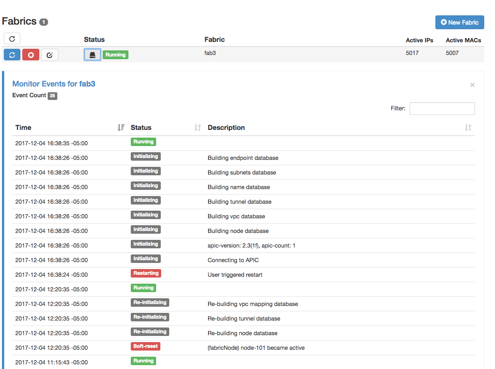
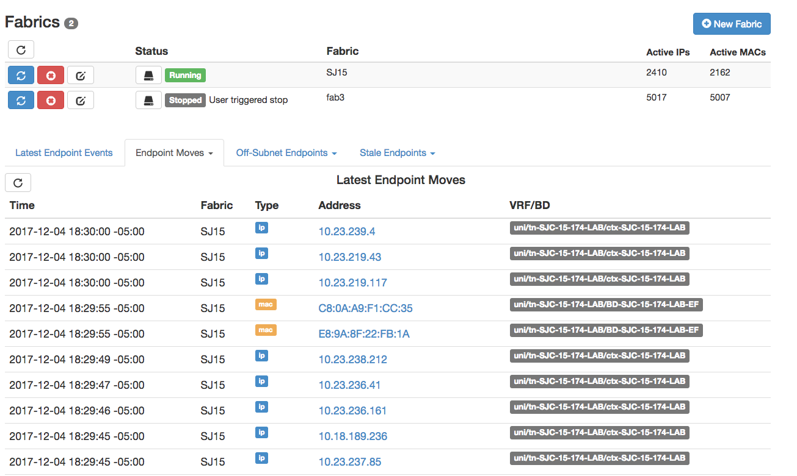

Usage
=====

Fabric Monitor Settings
-----------------------
The application can be configured to monitor multiple ACI fabrics.  You can setup a fabric to monitor by clicking on the **New Fabric** button on the home page and then fill out the form.  For existing monitors, you can click the fabric |Edit| button.

The options for each monitor are below:

- ``Unique Fabric Name`` The fabric name is used locally by endpoint tracker to distinguish between multiple fabrics. It must be a string between 1 and 64 characters and cannot be changed once configured. A short name such as **fab1** and **fab2** is recommended.

- ``APIC Hostname`` The hostname or IP address of a single APIC in the cluster. The application will use this IP to discover all other APICs in the cluster. If the initial APIC becomes unreachable, the other discovered APICs will automatically be used. Only out-of-band IPv4 address is currently supported for dynamic discovery of other APICs.

- ``APIC Credentials`` APIC username and password. User must have admin read access.

- ``Switch SSH Credentials`` Currently there is no API to clear an endpoint from a leaf. This application will SSH to the leaf and manually clear the endpoint.  A username and password with ssh access to the leaf is only required if you need to clear endpoints within the app. The application can be set to ssh to the leaf TEP via the APIC or SSH directly to the switch out-of-band address.

- The ``Notification Options`` The application can send syslog or email notifications for different events. At this time only one syslog server and one email address can be provided. If no value is configured then the application will not send any notification.  Click the |Down| button to select which types of notifications to be sent for each notification method:
    * Endpoint Move
    * Endpoint is becomes Stale on one or more leaves
    * An off-subnet endpoint is learned

- ``Remediate`` The application can remediate potentially impacting endpoints by clearing them from the affected nodes.  Remediate options are disabled by default but can be enabled under the fabric settings:
    * Automatically clear stale endpoints
    * Automatically clear off-subnet endpoints

- ``Advanced Settings`` Click the |Down| button for advanced settings. Generally these settings do not need to be changed unless needed for high scale environments.

    * perform endpoint move analysis
    * perform endpoint stale analysis
    * perform endpoint off-subnet analysis
    * ``max_ep_events`` maximum number of historical records per endpoint. When this number is exceeded, older records are discarded
    * ``max_workers`` maximum number of worker processes
    * ``max_jobs`` maximum queue size of pending events to processes. When this number is exceeded, the fabric monitor is restarted
    * ``max_startup_jobs`` maximum queue size of pending events to processes on initial endpoing build. When this number is exceeded, the fabric monitor is restarted
    * ``max_fabric_events`` maximum number of fabric monitor events. When this number is exceeded, older records are discarded

.. note:: When running in ``app-mode`` the fabric is automatically discovered when the app is installed on the APIC. The fabric name defaults to the controller fbDmNm, the APIC hostname is the docker gateway (**172.17.0.1** on most setups), and the APIC credentials user the app username with APIC created certificate.  Only one fabric can be monitored in ``app-mode``

.. warning:: There is a 2G memory set on the docker container while running in ``app-mode``.  Increasing the default max_jobs or max_startup_jobx can cause the application to crash.  If fabric scale requires higher thresholds, consider moving application from ``app-mode`` to standalone mode.  

Controlling the Monitors
------------------------

Once the fabric has been configured, you can view and control the status from the home page.  Use the following buttons to control the fabric:

- |ReStart| Start/Restart the monitors for the fabric
- |Stop| Stop the monitors for the fabric
- |Edit| Edit the fabric monitor settings
- |Refresh| Refresh the status of all fabric monitors along with Top and Recent events
- |History| View history events of the fabric monitor.

Fabric Monitor History
-----------------------

The fabric monitor can be manually started or restarted.  In addition, the monitor may restart if a new node comes online, a threshold such as max_jobs is exceeded, or a worker process has crashed.  The history of restart events can be seen by clicking the |History| button.  For example:

Fabric Overview
---------------

The fabric overview can be seen on the home page as soon as one or monitors are configured. The overview contains the last **50** records for the following events:

- ``Latest Endpoint Events`` - Each time an endpoint is created, deleted, or modified on a node the corresponding record will be created in the ``ep_history`` table.  The most recent events are displayed here.  

- ``Latest Moves`` - On each endpoint event, if ``analyze_move`` is enabled, a move analysis is performed.  If the node, ifId, encap, pcTag, rw_bd, or rw_mac has changed between the last two local events, and the move is not a duplicate of the previous move, then a new entry is added to the ``ep_moves`` table.  The most recent moves from the ``ep_moves`` table are displayed here.  

- ``Top Moves`` - Each entry added to the ``ep_moves`` table has a corresponding count.  The entries in the ``ep_moves`` table with the highest count are displayed here.

- ``Currently Off-Subnet Endpoints`` - On each IP endpoint event, if ``analyze_offsubnet`` is enabled, then analysis is performed to determine if endpoint is off-subnet.  This is done by mapping the pcTag to bd_vnid via the ``ep_epgs`` table and then checking the IP against list of subnets for the corresponding bd_vnid in the ``ep_subnets`` table. If the IP is determined to be off-subnet, then entry is marked with ``is_offsubnet`` flag in the ``ep_history`` table.  A job is added to the watch queue to ensure endpoint is still off-subnet after the transitory_offsubnet_time (30 seconds).  If the ``is_offsubnet`` flag has not been cleared, then an ``ep_offsubnet`` table.  The entries in the ``ep_history`` table with ``is_offsubnet`` flag set to True are display via ``Currently Off-Subnet Endpoints``

- ``Historical Off-Subnet Events`` - This displays the latest IP endpoints added to the ``ep_offsubnet`` table.

- ``Currently Stale Endpoints`` - On each endpoint event, if ``analyze_stale`` is enabled, then analysis is performed to determine if the endpoint is stale on any node.  This is performed by determining which node has learned the endpoint as a local entry (aware of vpc VTEP logic) and checking each node with an remote entry (XR) and ensuring it points back to the correct node.  If the XR entry points to proxy or points to a node which has an XR bounce entry, this is also considered a correct learn.  If the analysis determines the endpoint is stale, the ``is_stale`` flag is set in the ``ep_history`` table.  A job is added to the watch queue to ensure the endpoint is still stale after the transitory_stale_time (30 seconds) or transitory_xr_stale_time (300 seconds) for entries that should be deleted from fabric.  If the ``is_stale`` flag after the holdtime, then an entry is added to the ``ep_stale`` table.  The entries in the ``ep_history`` table with ``is_stale`` flag set to True are displayed via ``Currently Stale Endpoints``.

- ``Historical Stale Endpoint Events`` - This displays the latest endpoints added to the ``ep_stale`` table.

