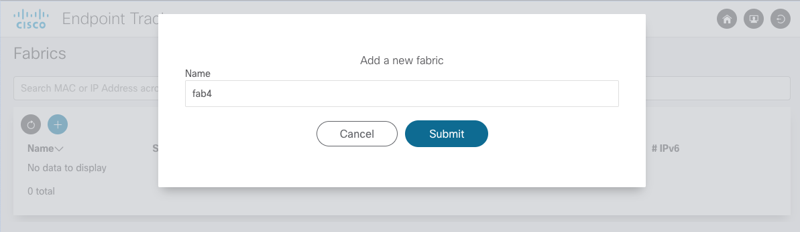
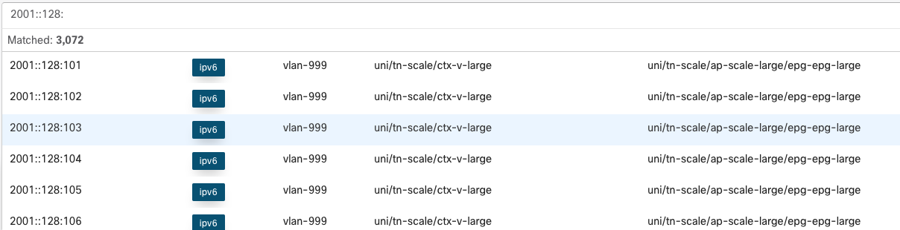
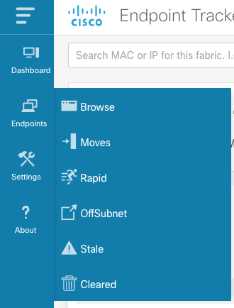
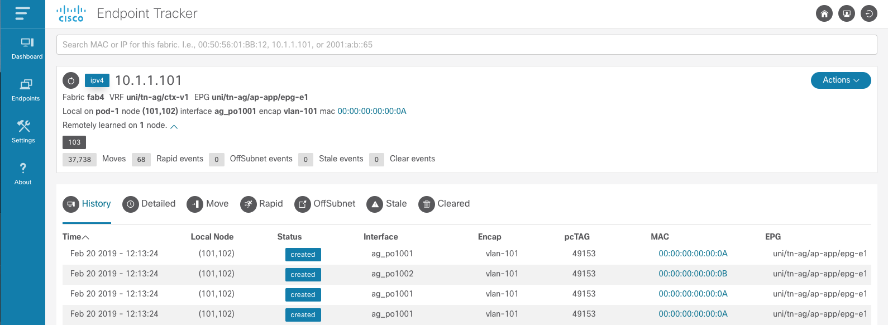
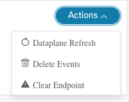
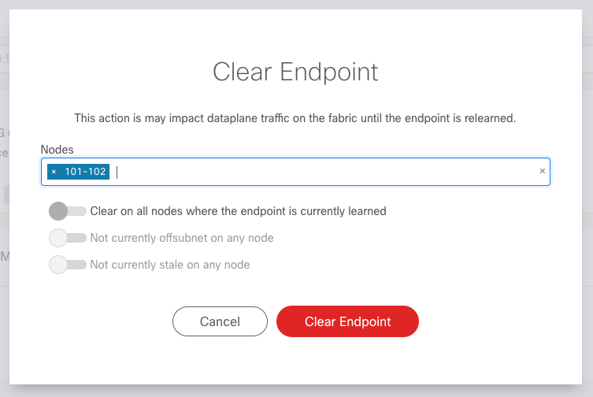
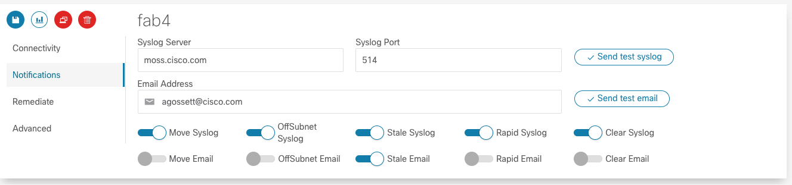
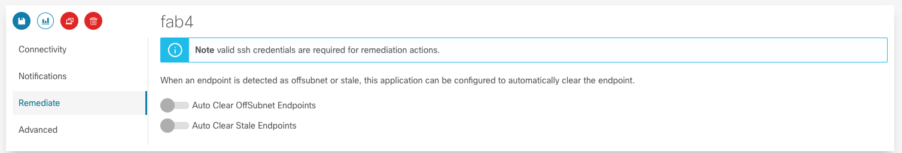

.. _usage:

Usage
=====

This section assumes EnhancedEndpointTracker has already been installed. Please refer to the 
:ref:`install` for more details regarding installation steps. This page will cover general usage of 
the application.  Note that some sections are specific to restricted to `standalone` mode only.

User Accounts
-------------

.. note:: This section is only applicable to `standalone` mode. In `app` mode the APIC handles all 
          authentication and authorization requests.

Once the application is installed, the default credentials are as follows:

* **username**: admin
* **password**: cisco

You can click the Users |users-icon| icon at the top right of the page to modify credentials along 
with adding and modifying users. The app supports an **admin** role which has full read and write 
access along with a read-only **user** role. Refer to :ref:`api` for more details regarding required 
role for each operation.

Fabrics
-------

.. note:: This section is only applicable to `standalone` mode. In `app` mode the fabric is auto 
          discovered when the app is installed. Only one fabric will be monitored.

Click the Home |home-icon| icon to access the home page and add fabrics to monitor. Multiple fabrics 
can be monitored by a single app and you can search for an endpoint from the Home page across all 
fabrics.  Simply click the Add icon and enter the fabric name. Once submitted you will be 
redirected to the :ref:`settings` page to further configure various monitoring options.

|standalone-add-fabric|

.. _dashboard:

Dashboard
---------

The dashboard page provides an overview of the current status of the fabric monitor. You can see an
overall count for the total number of active endpoints, a history of the fabric monitor events,
along with the uptime of the monitor. Operators can control the monitor via the Start |start-icon|
and Stop |stop-icon| icons.

.. tip:: Loopback addresses and pervasive SVIs are tracked but are not considered as active
         endpoints within the fabric and do not count toward the total active count. Additionally,
         if an endpoint has been deleted the records remain within the database and can be
         searched/viewed but will not count toward the total active count.

|fabric-dashboard|

Operators can quickly find an endpoint of interest by typing in the corresponding MAC, IPv4, or IPv6
address in the search bar at the top of the page. The search returns the number of endpoints matched
along with the full address, endpoint type, encapsulation, VRF name, and EPG name where the endpoint
is learned.

|fabric-typeahead-endpoint-search|

If the fabric is not running or ``eptManager`` is not active, then an appropriate message is
displayed at the top of the Dashboard page.

.. |stop-icon| image:: imgs/stop-icon.png
   :align: middle
   :width: 30

.. |fabric-dashboard| image:: imgs/fabric-dashboard.png
   :align: middle

.. _endpoints:

Endpoints
---------

There are several analyses performed and as a result several endpoint tables that can be viewed.
Each page supports various filtering, a total count for number of endpoints matching filter,
flexible sorting on attributes of interest, and resizable columns.

|fabric-endpoint-pages|

**Browse** allows operators to view the **Current Endpoint State** of for the fabric. Use this page
to walk through all active endpoints, filter on currently offsubnet, stale, or rapid endpoints.

**Moves** shows all endpoints that have moved within the fabric. The table is sorted by most recent
event but can also be sorted based on available column.  It is extremely useful to sorted based on
move event count which will show any endpoints that are unstable in the fabric. In the example below
we can see that ``10.1.1.101`` has moved ``37k`` times which indicates we may have
a misconfiguration that needs to be addressed. 

|fabric-endpoint-moves-page|

There are additional pages for **Rapid**, **Offsubnet**, **Stale**, and **Cleared** records. Each of
these pages are historical records for past detection events. Similar to **Moves**, operators can
sort and page through results as needed.

.. |fabric-endpoint-moves-page| image:: imgs/fabric-endpoint-moves-page.png
   :align: middle

Endpoint Details
^^^^^^^^^^^^^^^^

The power of the EnhancedEndpointTracker app is the **Endpoint Detail** page. This allows operators
to see the current state of endpoint within the fabric along with the historical records of what has
happened to the endpoint in the past. On the Overview section, the current state of the endpoint is
listed.  As seen in the example below, this includes the current location of the endpoint in the
fabric including VRF, EPG, pod, node, interface, encap, and rewrite information. All nodes where the
endpoint is remotely learned (XR) is also available.  Also, a summary count of each event type that
has occurred for this endpoint is displayed. If an endpoint is currently rapid, offsubnet, or stale
it will be highlighted along with the list of affected nodes.

|fabric-endpoint-detail|

.. tip:: All columns are resizable. Simply click to the left of the column name and drag the column
         to make it wider.

* **History** displays the local learn events for the endpoint in the fabric along with delete
  events

* **Detailed** is a per-node history of events that has occurred for this endpoint. It provides an
  additional search bar to filter on a specific attribute such as node, epg, pcTag, etc... This is
  extremely helpful for experienced operators who need to know the state and history of the endpoint 
  on a specific node.

* **Move** displays the move events for this endpoint. Each row has the source and destination for
  the move. 

* **Rapid** displays the rapid events detected for this endpoint. The timestamp when the endpoint
  was flagged as rapid along with the total number of epm events at that instance and the calculated
  rate of events are also displayed

* **OffSubnet** displays offsubnet events detected for this endpoint. The affected node, interface,
  encap, and EPG are also displayed. It's common that a misconfigured endpoint fails subnet check on
  the ingress leaf but still triggers a remote learn on another node. For this reason, the remote
  node column is available so operators know which leaf the offsubnet endpoint originated from.

* **Stale** displays stale events detected for this endpoint. Similar to the other tables, the
  affected node, interface, encap, EPG, and remote node are captured. Generally, a stale endpoint is
  a remote learn pointing to an incorrect leaf.  This table includes the expected remote node at the
  time the stale event was detected.

* **Cleared** displays the timestamp and reason an endpoint was cleared from the fabric by this app.

There are a few actions that can be performed on an endpoint.

|fabric-endpoint-actions|

* **Dataplane Refresh** will query the APIC for the most recent state of the endpoint in the fabric
  and update the app database. This is used as a sanity check to ensure that the state of the
  endpoint reported in the app is 100% correct. There is no impact to this operation but it does
  require that the fabric monitor is actively running.

* **Delete Events** will delete the endpoint information from the app database. It has no impact on
  the fabric. This is a useful mechanism to delete historical information on endpoints you no longer
  care about. After the entry is removed from the app, a refresh is also triggered to ensure the app
  stays in sync with the fabric. Therefore, you may notice that after the delete the endpoint is
  immediately relearned by the app.

* **Clear Endpoint** allows the operator to clear an endpoint from the fabric on one or more nodes.
  This operation requires SSH credentials are configured under the fabric :ref:`settings`. When
  clearing an endpoint, operators can provided a list of nodes. Operators can also use the available
  toggles:

  * **Clear on All Active Nodes** will clear the endpoint on all nodes that currently have the
    endpoint learned. This includes both local learns and remote learns

  * **Clear on All Offsubnet Nodes** will clear the endpoint on all nodes that have currently
    learned the endpoint offsubnet

  * **Clear on All Stale Nodes** will clear the endpoint on all nodes that are currently stale.

    .. warning:: Clearing the endpoint will trigger an EPM delete in the fabric. This can cause a 
                 traffic impact to the endpoint until it is relearned in the fabric. 

  |clear-fabric-endpoint|

.. _settings:

Settings
--------

The settings section is divided into multiple sub-sections. Ensure you click the Save |save-icon| 
icon to apply your changes.  If you update the connectivity settings you will need to restart the 
fabric monitor for them to be applied.

Connectivity
^^^^^^^^^^^^

.. note:: APIC hostname and API credentials are auto detected in `app` mode and cannot be changed.

Connectivity settings containing hostname and APIC credentials are required to access the fabric. An 
APIC username with **admin role** on the **all** security domain is required. SSH credentials are 
only required if clear endpoint functionality is required.  For ssh, a user with **admin** read 
role is required. When settings are saved the credentials are checked and an error is displayed if 
the credentials are invalid

|fabric-settings-connectivity|

.. |fabric-settings-connectivity| image:: imgs/fabric-settings-connectivity.png
   :align: middle

Notifications
^^^^^^^^^^^^^

There are very flexible notification options. Users can choose to be notified via syslog and email 
for each of the analysis and detection mechanisms available. **Once you've saved the settings** you 
can test both syslog and email servers by clicking the *Send test syslog* and *send test email* 
buttons, respectively. Ensure that the fabric monitor is actively running before attempting to test 
notifications.

In the example below, syslog notifications are generated for all events and an email is sent if a 
stale endpoint is detected.

|fabric-settings-notifications|

Syslog/Email Requirements
~~~~~~~~~~~~~~~~~~~~~~~~~

Syslogs and Email notifications are sent from the ``eptWatcher`` process. There are one or more 
DNS lookups performed before the message is sent. The following ports need to be allowed:

**Syslog**

* DNS lookup (**UDP** port **53**) for A-record of syslog server
* Syslog frame (**UDP** port **514** or custom configured port)

**Email**

* DNS lookup (**UDP** port **53**) for MX-record of email servers to reach configured email domain
* DNS lookup for corresponding A-record of each returned email server
* SMTP (**TCP** port **25**) connection to send the email to the selected email server

.. note:: When executing in app mode, the container is executed on the APIC and the source IP of 
          syslog/email notifications will be translated to the APIC inband or out-of-band address. 
          When running in standalone mode, the IP will be from the docker host.

Remediate
^^^^^^^^^

The application can be configured to automatically remediate offsubnet or stale endpoints. By 
default, auto-remediation is disabled.  

Remediation is performed by opening an ssh connection to the affected leaf and issuing an epm clear 
command to delete the endpoint.  Ssh credentials are required to perform this action. When an 
endpoint is cleared there is an entry logged to the Remediation database and a notification may be 
sent.  Fabric operators have full visibility into what clear events have occurred.

|fabric-settings-remediate|

Advanced
^^^^^^^^

There are several nerd knobs available to affect how the app is running. The default settings are 
suitable for most deployments. However, there may be scenarios where this settings need to be 
updated.  The following settings are available within the **Advanced** section. 

If you are using the API then these settings would apply to the **eptSettings** object.

|fabric-settings-advanced|

Enable/Disable Specific Analysis
~~~~~~~~~~~~~~~~~~~~~~~~~~~~~~~~

Each analysis feature can be enabled/disabled as needed. Disabling analysis for uninteresting events 
can improve worker efficiency. The following analysis is available:

* **Move** tracks move events within the fabric. When a move is detected, an event is added to the 
  **eptMove** table and an optional notification is sent.

* **Offsubnet** analysis keeps track of all configured fvSubnet/fvIpAttr objects in the fabric and 
  corresponding mapping to fvAEPg/fvBD. When an IP learn occurs, the vrf VNID and pcTag from the 
  endpoint are used to derive the originating EPG and corresponding BD. The IP is checked against 
  all subnets configured for that BD and if it doesn't match it the endpoint is flagged as 
  offsubnet. This mechanism can be used for both local (PL/VL) learns along with remove (XR) learns.
  When an offsubnet endpoint is detected, an event is added to the **eptOffsubnet** table and the
  **is_offsubnet** flag is set for the endpoint in the **eptEndpoint** table.

* **Stale** analysis tracks where in the fabric an endpoint is locally learned. When a new learn is 
  seen on a node, it is cross referenced to where it is expected to be learned. If the learn does 
  not point to the expected leaf (or leaf-pair in the case of vPC) then the endpoint is flagged as 
  stale. Note, stale analysis also includes the appropriate logic to handle bounce/bounce-to-proxy 
  scenarios. When a stale endpoint is detected, an event is added to the **eptStale** table and the
  **is_stale** flag is set for the endpoint in the **eptEndpoint** table.

* **Rapid** analysis is a mechanism that counts the number of events received across all nodes for 
  a single endpoint. If the number of events per minute exceed the configured threshold, then the 
  endpoint is flagged as rapid and further events from this endpoint are ignored until the rapid 
  hold-down timer have expired. Rapid analysis helps operators quickly determine if an endpoint is 
  unstable in the fabric.  Additionally, it protects the app from processing excessive events from 
  an unstable endpoint. When a rapid endpoint is detected, an event is added to the **eptRapid** 
  table and the **is_rapid** flag is set for the endpoint in the **eptEndpoint** table.

Event Count
~~~~~~~~~~~

Fabric monitor events (i.e., starting and stopping the monitor) are wrapped at a configurable count. 
Endpoint events are also wrapped within the database. Some events, such as local endpoint history 
and endpoint moves, are wrapped per endpoint. Other events, such as offsubnet and stale events, are 
wrapped per node and per endpoint. Users can set the following thresholds:

* **Max Fabric Monitor Events** the maximum number of fabric monitor events to keep. If the
  threshold is exceeded then older events are discarded.

* **Max Endpoint Events** the maximum number of endpoint events to keep. This applies to several 
  endpoint tables such as **eptEndpoint**, **eptMove**, and **eptRapid**.
 
* **Max Per-Node Endpoint Events** the maximum number of per-node endpoint events to keep. This 
  applies to all endpoint tables that are keyed per node. This includes **eptHistory**, 
  **eptOffsubnet**, **eptStale**, and **eptRemediate**.

Rapid Endpoint Paramaters
~~~~~~~~~~~~~~~~~~~~~~~~~

It is helpful be notified when an endpoint is creating a high number of events. This often indicates 
that the endpoint is unstable. When a endpoint is flagged as rapid, analysis is temporarily disabled 
for that endpoint and notifications are sent. Endpoints events are counted across all nodes and a 
rate of events per minute is calculated at regular intervals. When the configured threshold of 
events per minute is exceeded, the endpoint is flagged as rapid and analysis is disabled for the 
holdtime. If refresh is enabled, an API refresh request is sent to determine the current state of 
the endpoint after it is no longer marked as rapid.

* **Rapid Event Threshold** number of events per minute before an endpoint is marked as rapid.

* **Rapid Holdtime** is the number of seconds to ignore new events from an endpoint marked as rapid.

* **Rapid Refresh**, when an endpoint is no longer rapid the state of db is out of sync from the
  fabric. When endabled, a refresh is triggered to determine the current state of the previously
  rapid endpoint.

Stale Analysis
~~~~~~~~~~~~~~

When stale analysis is enabled, there are a few events that user may not wish to be treated as a 
stale event. A stale endpoint is generally a remote learn (XR) pointing to a leaf where the endpoint 
is no longer local. If the endpoint is no longer local in the fabric and the XR entry still exists 
on a node in the fabric, then the 'stale-no-local' logic is applied. If the endpoint is local on 
multiple nodes at the same time, then the last local node is assumed to be the correct entry and 
the 'stale-multiple-local' logic is applied. Note, this logic does not apply to vpc-attached 
endpoints which are expected to be learned on both nodes within the vpc.

* **Stale-no-local** enable stale-no-local detection
* **Stale-multiple-local** enable stale-multiple-local detection

Startup Event Queueing
~~~~~~~~~~~~~~~~~~~~~~

This app heavily leverages subscriptions for keeping the app db in sync with the APIC. When the
fabric monitor is started it needs to build the initial db state and setup appropriate MO
subscriptions. It is possible that changes are occurring during the initial build. To capture these
events, the subscriptions are started before the MO builds. After the build completes, any event
received is then analyzed.The number of events queued is dependent on the rate of events and the 
build time. It may be desirable to ignore the events during initialization, in which case queue 
events can be disabled.

* **Queue initial events** enables queueing of all standard MO events during build
* **Queue initial endpoint events** enables queuing of all EPM events during endpoint build

Session Timeout
~~~~~~~~~~~~~~~

By default the APIC session is gracefully restarted based on the aaaLogin maximumLifetimeSeconds 
attribute. Users can override the session timeout to a value lower than the aaaLogin lifetime by 
setting a limit on the session time. **Note** the fabric monitor needs to be restarted for this 
setting to take affect.

* **Session Timeout** maximum time in seconds before new login and websocket is started for APIC
  session

.. |fabric-settings-advanced| image:: imgs/fabric-settings-advanced.png
   :align: middle

